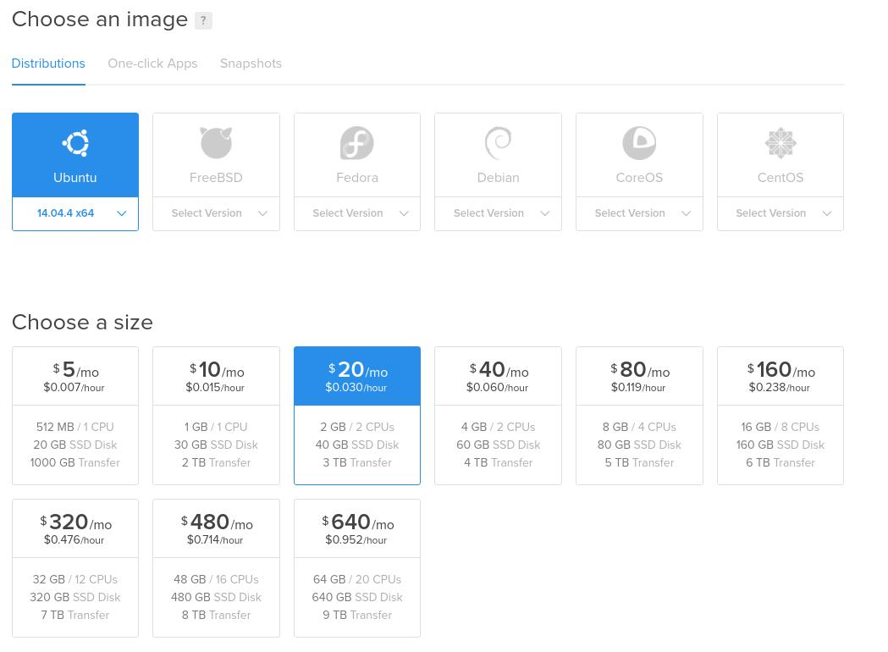
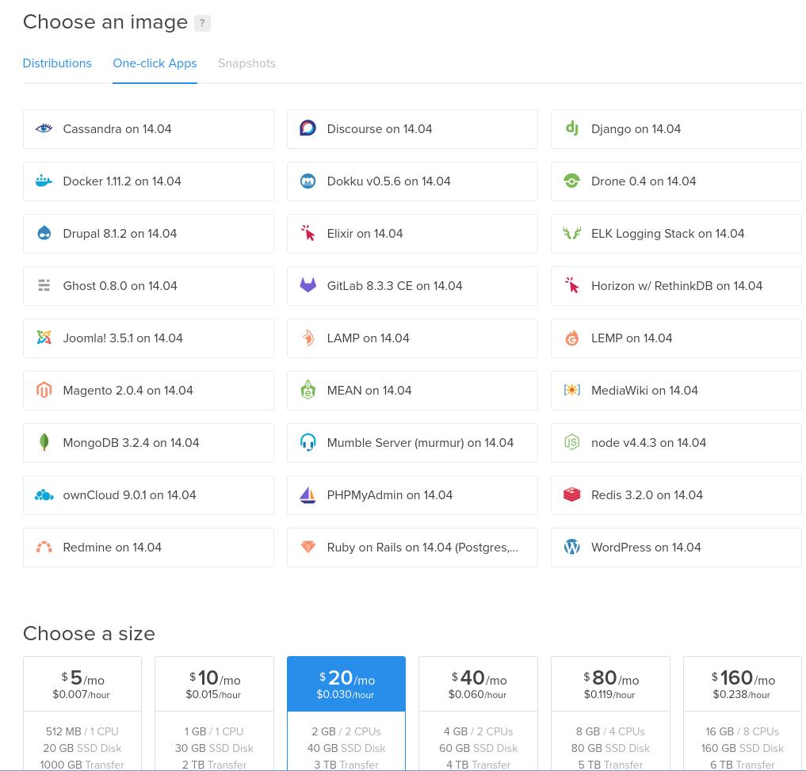

模板市场预研计划

### one-click模板 vs 传统模板
|对比项|one-click模板|传统模板|
|------|---------|--------|
|安装源|iso|iso|
|系统安装方式|简单配置kickstart，packer自动安装|人工操作|
|软件安装方式|shell、ansible自动安装|人工操作|
|维护|各种配置和脚本一目了然，可以反复执行，容易修改和查找问题|没有操作记录，维护升级都麻烦，效率低下|
|开发|需要深度了解系统配置，各种脚本语法准确使用，开发难度较高|了解系统基本操作，开发难度低|

### one-click模板愿景     
**  丰富的系统版本选择，自由配置的硬盘容量  **    

**  流行应用的快捷安装部署    **  


### 部署基础要求

| 名称	|cpu	| mem	|应用场景	| 
|--------|-------|-------|----------| 
|Docker |Linux 64bit  |     |应用容器引擎|
| LAMP  |Linux 32bit/64bit |256M  |Web应用程序平台|

### 实现技术
packer + ansible(playbook)
前提条件是在镜像已安装ansible，所以需要先用shell脚本安装ansible。
packer ansible-local负责上传playbook，生成hosts文件并执行ansible-playbook命令。
例子:
```
{
  "provisioners": [
      {
      "type": "shell",
      "execute_command": "echo 'SSH_PASSWORD' | {{.Vars}} sudo -S -E bash '{{.Path}}'",
          "scripts": [
            "template/script/centos6-6/ansible.sh"
          ]
    },
    {
      "type": "ansible-local",
      "playbook_file": "/home/code/mycode/go/src/main/template/ansible/installtomcatmysql/roles.yml",
      "role_paths": [
        "/home/code/mycode/go/src/main/template/ansible/installtomcatmysql/roles/mysql",
        "/home/code/mycode/go/src/main/template/ansible/installtomcatmysql/roles/tomcat"
      ]
    }
  ],
  "builders":
  [
    {
      "type": "qemu",
      "iso_url":"/home/html/iso/CentOS-6.6-x86_64-bin-DVD1.iso",
      "iso_checksum": "7b1fb1a11499b31271ded79da6af8584",
      "iso_checksum_type": "md5",
      "output_directory": "static/result/20160620150220/output/",
      "ssh_wait_timeout": "30s",
      "shutdown_command": "shutdown -P now",
      "disk_size": 6144,
      "format": "qcow2",
      "headless": false,
      "accelerator": "kvm",
      "http_directory": "httpdir",
      "http_port_min": 10082,
      "http_port_max": 10089,
      "ssh_host_port_min": 2222,
      "ssh_host_port_max": 2229,
      "ssh_username": "root",
      "ssh_password": "engine",
      "ssh_port": 22,
      "ssh_wait_timeout": "90m",
      "vm_name": "CentOS6-6.qcow2",
      "net_device": "virtio-net",
      "disk_interface": "virtio",
      "qemuargs": [
         [ "-m", "1024M" ]
      ],
      "boot_wait": "5s",
      "floppy_files": [
          "static/result/20160620150220/cfg/centos6-6.cfg"
      ],
      "boot_command":
      [
        "<tab> text ks=floppy:/centos6-6.cfg <enter><wait>"
      ]
    }
  ]
}
```
```
packer build centos6-6.json
```
下载iso--> packer创建标准化模板(ubuntu 20G) --> packer调用ansible实现应用模板
的分发(ubuntu+docker[docker installation playbook]) --> 测试  --> 发布

### 研发计划
1. 调研发行版的应用支持情况
2. 可行性分析
首选ubuntu14.04来调研，然后再向其他系统（centos,opensuse,windows等）扩展。
批量下载ansible-galaxy的应用安装脚本，并测试安装情况。
3. playbook编写
4. packer + playbook批量编译（开发/调试/）
将packer与ansible合并测试自动化模板制作。
5. 制件demo
用简单页面展示应用选择和模板制作过程。
6. 发布平台构建（cloudstack/openstack? ），是否引入QA？ 
7. bug-fix(随机密码)
