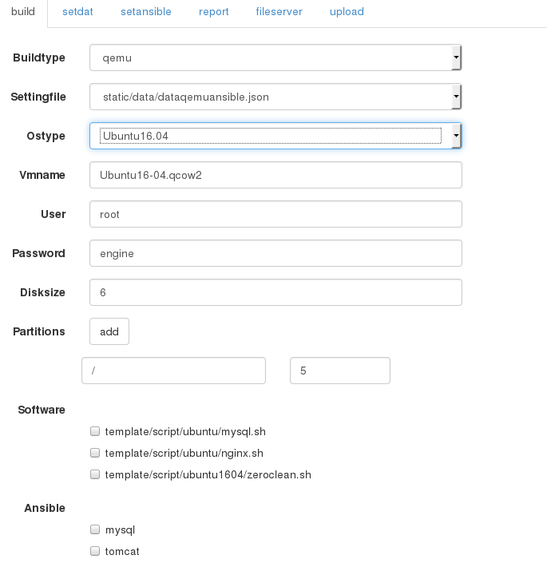
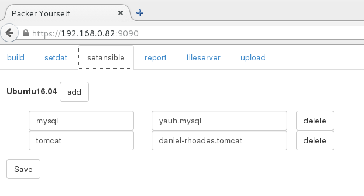
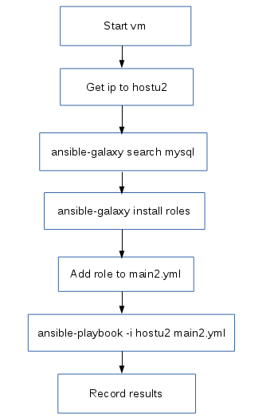

模板进度报告
### packer制作ubuntu16.04模板
主要处理了以下问题:
1. 安装后启动界面黑屏。
解决方法:在preseed脚本中添加update-grub命令。
2. 设置使用eth0来命名网卡。
解决方法:sed -i 's/GRUB_CMDLINE_LINUX=.*/GRUB_CMDLINE_LINUX="net.ifnames=0 biosdevname=0"/g' /etc/default/grub ;
3. 设置允许root的ssh登录。
解决方法:sed -i 's/^PermitRootLogin.*/PermitRootLogin yes/g' /etc/ssh/sshd_config
4. 只设置root用户，不设其他用户。
解决方法:preseed增加以下设置。
```
d-i passwd/root-login boolean true
d-i passwd/root-password-again password engine
d-i passwd/root-password password engine
d-i passwd/make-user boolean false
```
5. packer调用mysql的ansible playbook。
处理方法:
```
,"provisioners": [
{
"type": "shell",
"execute_command": "echo 'SSH_PASSWORD' | {{.Vars}} sudo -S -E bash '{{.Path}}'",
"scripts": [
"static/result/20160706112425/script/ansible.sh"]}
,{
"type": "ansible-local",
"playbook_file": "static/result/20160706112425/ansible/main.yml",
"role_paths": [
"/etc/ansible/roles/yauh.mysql"]}]
}
```

完整的preseed文件
```
choose-mirror-bin mirror/http/proxy string
d-i base-installer/kernel/override-image string linux-server
d-i clock-setup/utc boolean true
d-i clock-setup/utc-auto boolean true
d-i finish-install/reboot_in_progress note
d-i grub-installer/only_debian boolean true
d-i grub-installer/with_other_os boolean true

d-i partman-basicfilesystems/no_swap boolean false
d-i partman-auto/method string regular
d-i partman-auto/expert_recipe string boot-root :: 5120 4000 -1 ext4 $primary{ } method{ format } format{ } use_filesystem{ } filesystem{ ext4 } mountpoint{ / } . 

d-i partman-partitioning/confirm_write_new_label boolean true
d-i partman/choose_partition select finish
d-i partman/confirm boolean true
d-i partman/confirm_nooverwrite boolean true

d-i pkgsel/include string openssh-server 
d-i pkgsel/install-language-support boolean false
d-i pkgsel/update-policy select none
d-i pkgsel/upgrade select full-upgrade
d-i time/zone string UTC
tasksel tasksel/first multiselect standard, ubuntu-server

d-i console-setup/ask_detect boolean false
d-i keyboard-configuration/layoutcode string us
d-i keyboard-configuration/modelcode string pc105
d-i debian-installer/locale string en_US

# Create user account.
d-i passwd/root-login boolean true
d-i passwd/root-password-again password engine
d-i passwd/root-password password engine
d-i passwd/make-user boolean false
#d-i passwd/user-fullname string root
#d-i passwd/username string root
#d-i passwd/user-password password engine
#d-i passwd/user-password-again password engine
d-i user-setup/allow-password-weak boolean true
d-i user-setup/encrypt-home boolean false
#d-i passwd/user-default-groups clouder sudo
d-i passwd/user-uid string 900

d-i preseed/late_command string \
    in-target sed -i 's/GRUB_CMDLINE_LINUX=.*/GRUB_CMDLINE_LINUX="net.ifnames=0 biosdevname=0"/g' /etc/default/grub ; \
    in-target sed -i 's/^PermitRootLogin.*/PermitRootLogin yes/g' /etc/ssh/sshd_config;\
    in-target update-grub ;
```
packer的json文件:
```
{
    "variables": {
        "user": "root",
        "password": "engine"
    },
    "builders":
    [
        {
            "vm_name": "Ubuntu16-04.qcow2",
            "type": "qemu",
            "format": "qcow2",
            "output_directory": "static/result/20160706112425/output/",
            "accelerator": "kvm",
            "disk_size": 6144,
            "headless": false,
            "iso_url":"/home/html/iso/ubuntu-16.04-server-amd64.iso",
            "iso_checksum": "23e97cd5d4145d4105fbf29878534049",
            "iso_checksum_type": "md5",
            "http_directory": "static/result/20160706112425/cfg",
            "ssh_username": "{{user `user`}}",
            "ssh_password": "{{user `password`}}",
            "ssh_wait_timeout": "90m",
            "shutdown_command": "echo '{{user `password`}}'|sudo -S shutdown -P now",
	    "qemuargs": [
	       [ "-m", "512M" ]
	     ],
            "net_device": "virtio-net",
            "disk_interface": "virtio",
            "boot_wait": "2s",
            "boot_command": [
        "<enter><wait><f6><esc><bs><bs><bs><bs><bs><bs><bs><bs><bs><bs><bs><bs><bs><bs><bs><bs><bs>",
        "<bs><bs><bs><bs><bs><bs><bs><bs><bs><bs><bs><bs><bs><bs><bs><bs><bs><bs><bs><bs><bs><bs>",
        "<bs><bs><bs><bs><bs><bs><bs><bs><bs><bs><bs><bs><bs><bs><bs><bs><bs><bs><bs><bs><bs><bs>",
        "<bs><bs><bs><bs><bs><bs><bs><bs><bs><bs><bs><bs><bs><bs><bs><bs><bs><bs><bs><bs><bs><bs>",
        "/install/vmlinuz<wait>",
        " auto<wait>",
        " console-setup/ask_detect=false<wait>",
        " console-setup/layoutcode=us<wait>",
        " console-setup/modelcode=pc105<wait>",
        " debconf/frontend=noninteractive<wait>",
        " debian-installer=en_US<wait>",
        " fb=false<wait>",
        " initrd=/install/initrd.gz<wait>",
        " kbd-chooser/method=us<wait>",
        " keyboard-configuration/layout=USA<wait>",
        " keyboard-configuration/variant=USA<wait>",
        " locale=en_US<wait>",
        " netcfg/get_domain=vm<wait>",
        " netcfg/get_hostname=vagrant<wait>",
        " grub-installer/bootdev=/dev/vda<wait>",
        " noapic<wait>",
        " net.ifnames=0 ",
        " preseed/url=http://{{ .HTTPIP }}:{{ .HTTPPort }}/ubuntu16-04.cfg",
        " -- <wait>",
        "<enter><wait>"
            ]
        }
    ]
,"provisioners": [
{
"type": "shell",
"execute_command": "echo 'SSH_PASSWORD' | {{.Vars}} sudo -S -E bash '{{.Path}}'",
"scripts": [
"static/result/20160706112425/script/ansible.sh"]}
,{
"type": "ansible-local",
"playbook_file": "static/result/20160706112425/ansible/main.yml",
"role_paths": [
"/etc/ansible/roles/yauh.mysql"]}]
}
```
### 页面添加ansible配置
build页面添加ansible安装的多选项

setansible页面可以手工配置安装role的名称，跟ansible-galaxy安装的role名称对应。

### 用python编写ansible-galaxy自动搜索脚本
程序流程图：

脚本如下:
```
#!/usr/bin/python
import libvirt
import os
import sys
import re
import subprocess
import time
import shutil
import json

rolename="mysql"
times=20
try:
  conn=libvirt.open("qemu:///system")
  pv = conn.lookupByName('testubuntu1604grub3')
  if pv.state()[0]==1 :
     print("vm shutdowning")
     pv.shutdown()
     time.sleep(30)
  cmd='qemu-img create -f qcow2 /home/html/downloads/Ubuntu16-04\(2\).qcow2 -b /home/html/downloads/Ubuntu16-04\(4\).qcow2 '
  p=subprocess.Popen(args=cmd,shell=True,stdout=subprocess.PIPE,stderr=subprocess.STDOUT,close_fds=True)
  (stdoutdata,stderrdata)=p.communicate()
  if p.returncode !=0:
     print (cmd+'error')
  if pv.state()[0]<>1 :
     print("vm starting")
     pv.create()
     time.sleep(30)
except (ValueError,libvirt.libvirtError):
  print("vm error")
  pass
print("vm running")  
obj = pv.interfaceAddresses(0)
print obj[obj.keys()[0]]['addrs'][0]['addr']

fo = open("hostu2", "wb")
fo.write(obj[obj.keys()[0]]['addrs'][0]['addr']+" ansible_ssh_user=root ansible_ssh_pass=engine")
#fo.write(obj[obj.keys()[0]]['addrs'][0]['addr'])
fo.close()

fa = open("allrecord2", "w")
fa.close()
fs = open("successrecord2", "w")
fs.close()

cmd='ansible-galaxy search '+rolename
p=subprocess.Popen(args=cmd,shell=True,stdout=subprocess.PIPE,stderr=subprocess.STDOUT,close_fds=True)
(stdoutdata,stderrdata)=p.communicate()
if p.returncode !=0:
 print (cmd+'error')

booklist=[]
i=0
for r in str(stdoutdata).split("\n"):
 i+=1
 if i<6 :
   if i==2 : print (r) 
   continue
 if i>times : break
 j=0
 for r2 in r.split(" "):
   if j==0 : 
     j+=1
     continue
   booklist.append(r2)
   break

i=0
for r2 in booklist :
   i+=1
   cmd='ansible-galaxy install '+r2
   print cmd + '  '+str(i)
   p=subprocess.Popen(args=cmd,shell=True,stdout=subprocess.PIPE,stderr=subprocess.STDOUT,close_fds=True)
   (stdoutdata,stderrdata)=p.communicate()
   print str(stdoutdata)
   print p.returncode
   if p.returncode !=0:
      print (cmd+' error')
record={"Ubuntu16.04":{rolename:[]}}
i=0
for r2 in booklist :
      i+=1
      time.sleep(3)
      foo = open("main2.yml", "wb")
      foo.write("- hosts: all\n  roles:\n  - "+r2)
      foo.close()
      print("playbook "+str(i)+" "+r2)
      cmd='ansible-playbook -i hostu2 main2.yml'
      print cmd
      p=subprocess.Popen(args=cmd,shell=True,stdout=subprocess.PIPE,stderr=subprocess.STDOUT,close_fds=True)
      (stdoutdata,stderrdata)=p.communicate()
      print str(stdoutdata)
      result=p.returncode
      fa = open("allrecord2", "a")
      fa.write("playbook "+str(i)+" "+r2+" result:"+str(result)+"\n")
      fa.close()
      if result==0 :
         fs = open("successrecord2", "a")
         fs.write("playbook "+str(i)+" "+r2+"\n")
         fs.close()
         record["Ubuntu16.04"][rolename].append(r2)
fr=open("record.json","wb")
fr.write(json.dumps(record))
fr.close()
#      else :
#         cmd='ansible-galaxy remove '+r2
#         print cmd
#         p=subprocess.Popen(args=cmd,shell=True,stdout=subprocess.PIPE,stderr=subprocess.STDOUT,close_fds=True)
#         (stdoutdata,stderrdata)=p.communicate()
#         print str(stdoutdata)
```
执行结果是输出两个文件allrecord2、successrecord2。    
allrecord2收集所有roles的执行结果，0是成功，非0是失败。    
successrecord2只收集成功的roles，以便packer后期整合处理。    
目前只搜索了mysql的roles,146个roles里有14个可以安装成功。    
allrecord2如下：
```
playbook 1 vicenteg.mysql_server result:1
playbook 2 gcoop-libre.mysqldump result:2
playbook 3 yellowsnow.mysql-vagrant result:1
playbook 4 yauh.mysql result:0
playbook 5 ngpestelos.mysql result:0
playbook 6 manala.mysql result:0
playbook 7 Rackspace_Automation.mysql result:2
playbook 8 TalLannder.mysql result:2
playbook 9 robr3rd.repo-mysql result:0
playbook 10 marcelocorreia.mysql-install result:2
...
playbook 145 nkadithya31.ansible result:0
playbook 146 CajuCLC.rax-magento-lamp-db result:0
```
successrecord2如下：
```
playbook 4 yauh.mysql
playbook 5 ngpestelos.mysql
playbook 6 manala.mysql
playbook 9 robr3rd.repo-mysql
playbook 18 megheaiulian.mysql
playbook 27 memiah.mysql-s3-backup
playbook 44 rchouinard.mysql-community-repo
playbook 86 zauberpony.mysql-query
playbook 134 tersmitten.percona-server-tools
playbook 137 CajuCLC.rax-magento-web_master_slave-db
playbook 139 CajuCLC.magento-lamp-single
playbook 140 CajuCLC.rax-magento-lamp-single
playbook 145 nkadithya31.ansible
playbook 146 CajuCLC.rax-magento-lamp-db
```
### 下一步计划
1. 将ansible-galaxy筛选出来的roles整合入packer里，进行合并调试。
2. tomcat、docker、git、nginx、wordpress、nodejs、mongodb等应用roles筛选安装调试。
