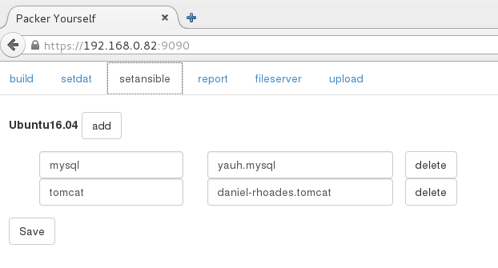
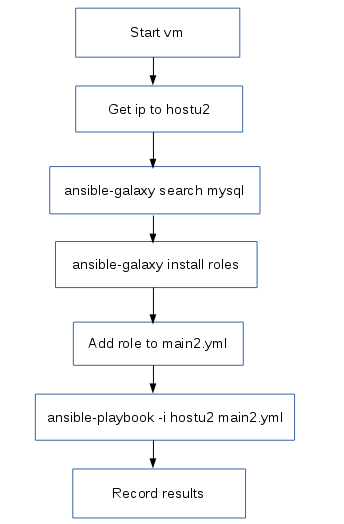

# 模板进度报告
### packer制作ubuntu16.04模板
主要处理了以下问题:
1. 安装后启动界面黑屏。
2. 设置使用eth0来命名网卡。
3. 设置允许root的ssh登录。
4. 只设置root用户，不设其他用户。

### 页面添加ansible配置
build页面添加ansible安装的多选项

setansible页面可以手工配置安装role的名称，跟ansible-galaxy安装的role名称对应。

编码已初步实现
### 用python编写ansible-galaxy自动搜索脚本
程序流程图：

编码已初步实现

### 下一步计划
1. 将ansible-galaxy筛选出来的roles整合入packer里，进行合并调试。
2. tomcat、docker、git、nginx、wordpress、nodejs、mongodb等应用roles筛选安装调试。
