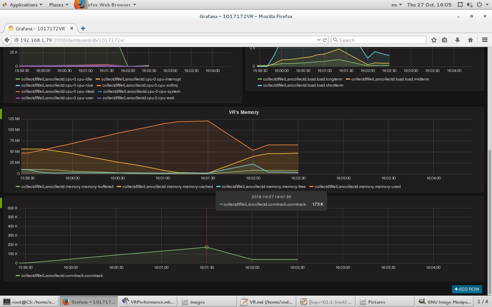
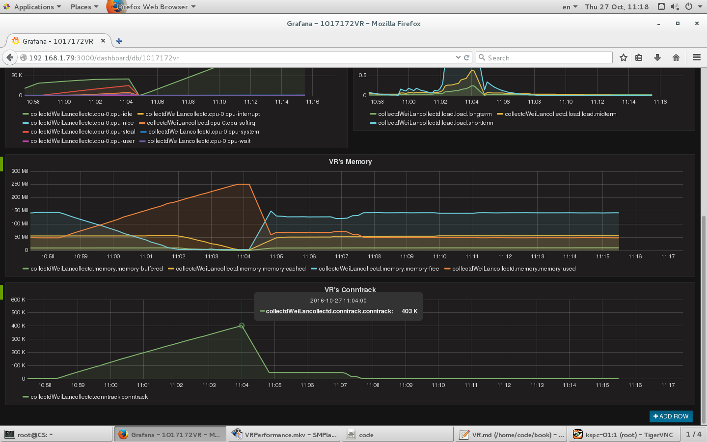
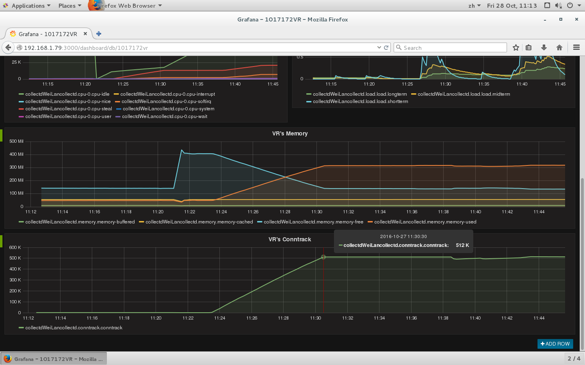
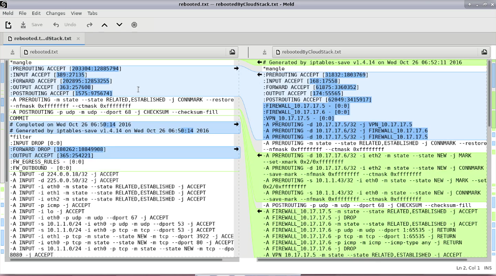

### 调查背景
VR的作用：实现虚拟网络功能。每个来宾网络(客户网络)对应至少一个vRouter，当启动某个网络的第一台客户虚拟机时，vRouter会自动创建出来，若一个客户网络长时间不存在启动的虚拟机，该网络的vRouter会自动关闭。
VR服务类型：IPAM (DHCP)、DNS、NAT、Source NAT、防火墙、端口转发、负载均衡、VPN等等。
VR的问题：VR经常自动重启或者假死。

### 1. 验证环境
cloudstack4.5.1 (15G RAM)
轰炸机：ubuntu14.04 (3G RAM)
监控：collectd+graphite+grafana
### 2. 验证方法
VR安装collectd，收集和上传监测数据。
cloudstack上传炸弹机服务器模板，启动一个炸弹机器实例BombServer。
修改VR内存设置，分别设置内存128M、256M、512M，来进行轰炸测试。
```
mysql -ucloud -pengine -e "UPDATE cloud.service_offering SET ram_size='512', speed='500' WHERE vm_type='domainrouter'"
service cloudstack-management restart
service cloudstack-agent restart
```
在cloudstack页面重启VR后，内存会变更成最新配置，就可以开始连接轰炸。
炸弹机服务器实例启动方法
```
cd /root/BombVR
./server
```
轰炸机客户端独立用qemu启动
```
cd /home/adminubuntu/testmachine
./startmachine.sh
```
```
sudo qemu-system-x86_64 -net nic,model=virtio,macaddr=52:54:00:12:34:56,vlan=1 -net tap,vlan=1 -net nic,model=virtio,macaddr=52:54:00:12:34:57,vlan=2 -net tap,vlan=2 -net nic,model=virtio,macaddr=52:54:00:12:34:58,vlan=3 -net tap,vlan=3 -net nic,model=virtio,macaddr=52:54:00:12:34:59,vlan=4 -net tap,vlan=4 -net nic,model=virtio,macaddr=52:54:00:12:34:60,vlan=5 -net tap,vlan=5 -net nic,model=virtio,macaddr=52:54:00:12:34:61,vlan=6 -net tap,vlan=6 -net nic,model=virtio,macaddr=52:54:00:12:34:62,vlan=7 -net tap,vlan=7 -net nic,model=virtio,macaddr=52:54:00:12:34:63,vlan=8 -net tap,vlan=8 -hda ./ubuntu1404-Docker.qcow2 -m 5120 --enable-kvm
```
炸弹机客户端启动方法
```
cd /root/BombVR
./ethernet.sh
./startbomb.sh
```
修改连接数限制两个配置文件
/etc/sysctl.conf 
```
fs.file-max=1048576
net.netfilter.nf_conntrack_max = 6553500
net.ipv4.ip_local_port_range= 1024 65535
```
/etc/security/limits.conf 
```
cloud soft nproc -1
cloud hard nproc -1
* soft nofile 1048576
* hard nofile 1048576
root - nofile 1048576
root hard nofile 1048576
root soft nofile 1048576
```
### 3. 验证数据
128M  VR   17W链接内存爆满，自动重启，实例网络连接断开。

256M  VR   40W链接内存爆满，自动重启，实例网络连接断开。

512M  VR   51W链接后不再增加，也没有出现重启，实例网络连接保持。

iptables数据对比

### 4. 结论
连接数增加会导致VR内存使用增加，内存爆满后VR会自动重启。
如果是VR自动重启，虚拟机实例的iptables规则会缺失，对外连接断开。
如果由cloudstack页面重启VR，虚拟机实例的iptables规则会自动补全，恢复连接。
