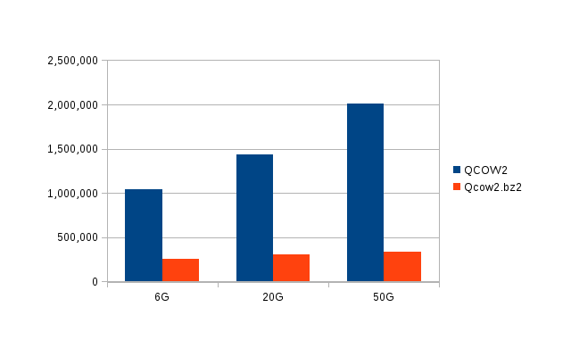

#模版容量大小对比调查
##1.模版容量与镜像文件大小
###1.1 Windows7(20G、30G、50G)，qcow2＆vhd
制作模版步骤：
```
$ packer build windows7.json
$ qemu-img convert -O vpc windows7.qcow2 windows7.vhd
$ bzip2 -z windows7.vhd
```
以下数据来自于用同一模板定义文件生成的qcow2和vhd格式磁盘镜像尺寸对比。   
数据如下（单位KB）：   
disksize: 定义硬盘大小   
qcow2: kvm 虚拟磁盘镜像格式    
vhd: xenserver虚拟磁盘镜像格式    
vhd.bz2: 用BZ2算法压缩后的格式   
upload cloudstack:上传cloudstack后在二级存储中的模版文件   

###1.2 Centos6.6(6G、20G、50G)，qcow2&vhd
步骤同上。数据如下（单位KB）：   


其中qcow2文件与硬盘容量对比（单位KB）：   

###1.3 结论
* qcow2转换成vhd时文件大小与虚拟硬盘大小一样，上传cloudstack后在二级存储中的模版也一样。
* bzip2压缩文件至少有30％的压缩率。
* Centos6.6的qcow2文件大小与虚拟硬盘大小成正比，压缩后文件也一样。Windows7基本不变。

制作模版建议：基础模版应该设置尽量小的虚拟硬盘并作压缩，以保证上传cloudstack的效率和节省空间。

##2. 模版空闲区域与镜像文件大小
###2.1 qcow2清除空闲区域
windows7用以下命令来清除空闲区域，sdelete需要另行下载(http://download.pchome.net/system/sysenhance/detail-87077.html)。
```
$ sdelete -c
```
centos/ubuntu/opensuse用以下命令来清除空闲区域
```
$ dd if=/dev/zero of=/dump;rm -f /dump
```
再用以下命令将文件进行转换
```
$ qemu-img convert -O qcow2 windows7.qcow2 windows7new.qcow2
```
对转换前后的文件进行压缩
```
$ bzip2 -z  windows7.qcow2
```
数据如下（单位KB）:   
qcow2: kvm 虚拟磁盘镜像格式    
oldqcow2.bz2: 转换前的压缩文件    
dd/sdelete&convert:经过dd/sdelete转换后的文件   
newqcow2.bz2: 转换后的压缩文件  
    
结论:
* 对于centos/ubuntu/opensuse系统，用dd命令可以有效减少空闲区域，从而减少qcow2文件大小。
* 对于windows系统，用sdelete能清空空闲区域，但是不一定会减少qcow2文件大小。可能与windows版本相关。

###2.2 vhd清除空闲区域
清除方法同上，再用以下命令将文件进行转换
```
$ vboxmanage clonehd --format VHD windows7.vhd windows7new.vhd
```
数据如下（单位KB）:   
vhd: xenserver 虚拟磁盘镜像格式    
oldvhd.bz2: 转换前的压缩文件    
dd/sdelete&convert:经过dd/sdelete转换后的文件   
newvhd.bz2: 转换后的压缩文件  
    

结论：
* 虚机内有大量文件删除操作后，用dd命令来做清除处理就会有明显效果。
* windows7使用sdelete清除后，转换出来的vhd文件有明显缩小。
